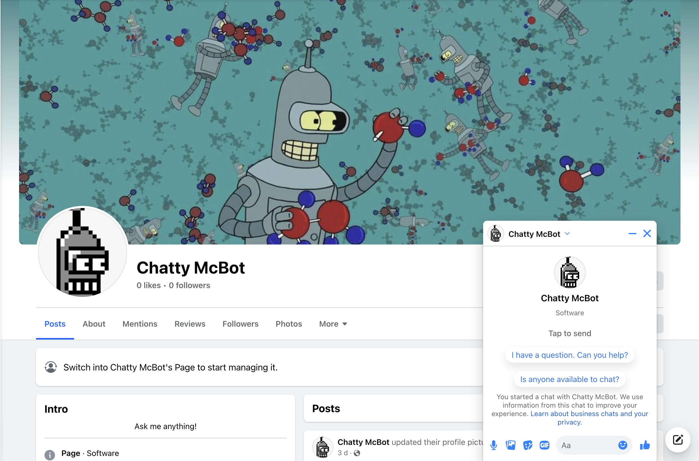
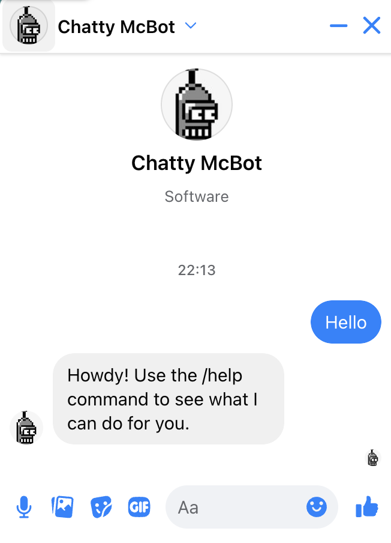
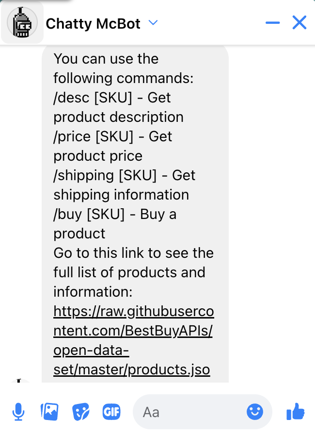
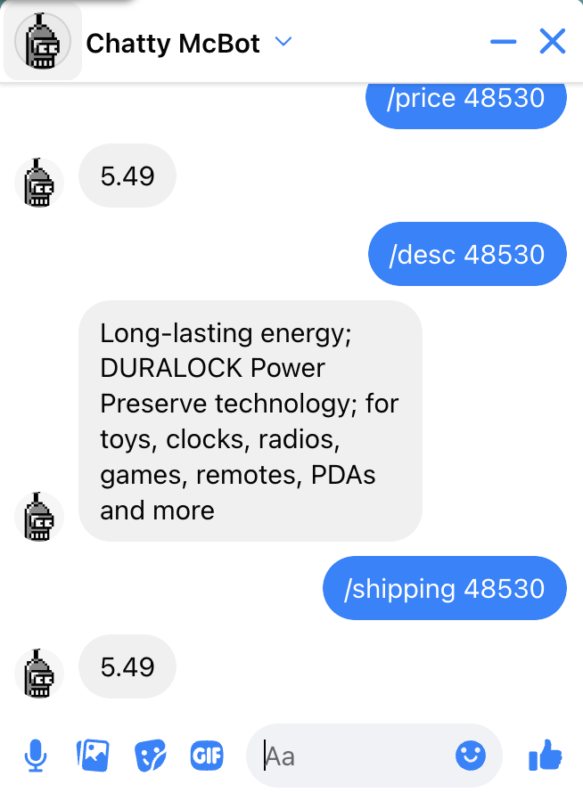
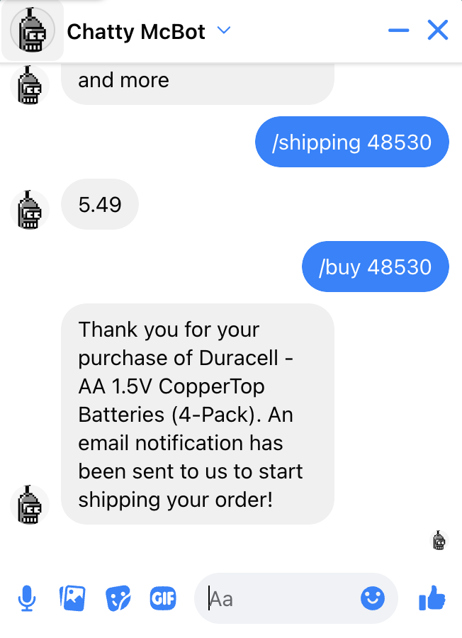
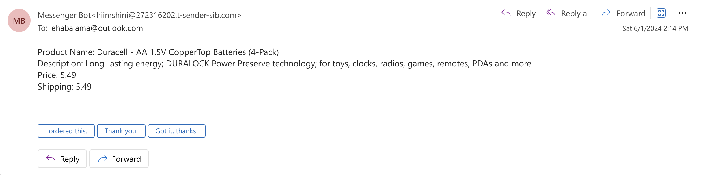
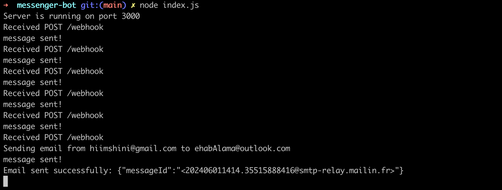

# Messenger Bot

This project is a backend service for a Facebook Messenger bot, developed using Node.js. It handles various product-related queries by integrating with a MySQL database for data storage and retrieval. Additionally, it leverages Sendinblue for sending email notifications about product purchases. The tech stack includes Node.js for the server-side logic, MySQL for the database, Sendinblue for email services, and Ngrok for local development and testing with Facebook's webhooks. The bot supports commands to fetch product descriptions, prices, and shipping information, enhancing user interaction with automated responses.

## Features

1. **Greeting Message**: Sends a random greeting message when a user messages the page for the first time.
2. **Product Queries**:
   - `/desc [SKU]` - Get product description.
   - `/price [SKU]` - Get product price.
   - `/shipping [SKU]` - Get shipping information.
3. **Purchasing Products**: 
   - `/buy [SKU]` - Sends an email notification with the product details.
4. **Help Command**:
   - `/help` - Lists available commands.
5. **Database Integration**: Fetches product information from a MySQL database.
6. **Email Notifications**: Sends purchase details via Sendinblue.

## Getting Started

### Prerequisites

- Node.js
- MySQL
- Facebook Developer Account
- Ngrok

### Installation

1. Clone the repository:
    ```sh
    git clone https://github.com/EhabLama/messenger-bot.git
    cd messenger-bot
    ```

2. Install dependencies:
    ```sh
    npm install
    ```

3. Set up your MySQL database:
    - Create a database named `productDB`.
    - Run the following commands to create the `products` table:
    ```sh
    CREATE TABLE products (
        id INT AUTO_INCREMENT PRIMARY KEY,
        sku INT NOT NULL UNIQUE,
        name VARCHAR(255) NOT NULL,
        type VARCHAR(50),
        price DECIMAL(10, 2),
        upc VARCHAR(50),
        category JSON,
        shipping DECIMAL(10, 2),
        description TEXT,
        manufacturer VARCHAR(100),
        model VARCHAR(50),
        url VARCHAR(255),
        image VARCHAR(255)
    );
    ```

4. Populate the database:
    - Run the script to load products into the database:
    ```sh
    node src/scripts/loadProducts.js
    ```

5. Start your server:
    ```sh
    npm start
    ```

6. Run Ngrok to expose your local server to the internet:
    ```sh
    ngrok http 3000
    ```

7. Set up your Facebook page webhook with the Ngrok URL and the `/webhook` endpoint:
    - **Callback URL**: `https://<your-ngrok-url>/webhook`
    - **Verify Token**: Use the same token set in your `.env` file (`VERIFY_TOKEN`).

### Facebook Page Setup

1. **Create a Facebook Page**: Follow [this guide](https://www.facebook.com/pages/create) to create a new Facebook page.
2. **Create a Facebook App**:
    - Go to the [Facebook Developer Portal](https://developers.facebook.com/) and create a new app.
    - Add the Messenger product to your app.
    - Generate a Page Access Token and subscribe your webhook to the page events and add it to the env file.

### Set up Sendinblue

1. Create an account on [Sendinblue](https://www.sendinblue.com/).
2. Verify the sender email address.
3. Get your API key from the Sendinblue dashboard.

### Demo

Here are some screenshots demonstrating the bot's functionality:

### 1. Facebook Page Setup



The bot is connected to a Facebook Page for interaction with users.

### 2. Greeting Message



The bot sends a random greeting when a user messages for the first time.

### 3. Help Command



The `/help` command provides a list of available commands to the user.

### 4. Product Queries



The bot responds to product queries like `/desc`, `/price`, and `/shipping`.

### 5. Purchase Handling



The bot processes purchase requests and sends email notifications.

### 6. Email Notification



The bot sends an email notification when a purchase is made.

### 7. Terminal Output



Terminal output showing the bot's responses and operations.


## License

This project is licensed under the MIT License - see the [LICENSE.md](LICENSE.md) file for details.
